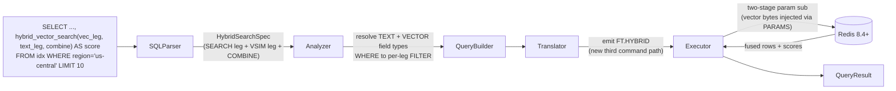

# Spec: `FT.HYBRID` support in sql-redis

**Jira:** [RAAE-1322](https://redislabs.atlassian.net/browse/RAAE-1322) ·
**Status:** Draft ·
**Requires:** Redis 8.4+ and redis-py >= 7.1.0 (RediSearch `FT.HYBRID`)

# Goal

Add a `hybrid_vector_search(...)` SELECT function that translates a SQL `SELECT` into a native
`FT.HYBRID` command, so a text query and a vector query are **fused server-side** (RRF or
LINEAR) into a single ranking. This is distinct from today's pre-filter hybrid search,
where text is only a hard prefilter and the ranking comes from the vector leg alone. sql-redis exists
to give a familiar SQL surface over a Redis query; `hybrid_vector_search()` makes the new
server-side fusion query just as easy to express.

Hard constraint: the syntax must read as a natural extension of the vector syntax we have
today (`cosine_distance(field, :vec)` plus `:param` substitution), and its options must
mirror what `FT.HYBRID` exposes so the two RedisVL surfaces (native `HybridQuery` and
`SQLQuery`) stay coherent.

> Terminology note. The README/docs currently label filter-then-KNN as
> "Hybrid search (filters + vector)". That is not `FT.HYBRID`. This work uses:
>
> - **pre-filter hybrid search**: existing `WHERE ... cosine_distance(...)` to
>   `(prefilter)=>[KNN ...]`. One ranking signal (vector); text/tags are hard filters.
> - **hybrid fusion** (this spec): new `hybrid_vector_search(...)` to `FT.HYBRID`. Two
>   independently ranked legs (text + vector) fused by RRF/LINEAR.
>
> Part of this work is relabeling the existing docs to "pre-filter hybrid search" so the
> two are not conflated.

# Flow



# Syntax

`hybrid_vector_search(...)` is a SELECT-clause function that composes the two ranking functions
the package already exposes: the vector leg reuses `cosine_distance(field, :vec)` and the
text leg reuses `fulltext(field, 'query')`. A third argument selects the fusion method.

```sql
SELECT user, job, job_description,
       hybrid_vector_search(
           cosine_distance(job_embedding, :vec),                       -- VSIM leg: vector field + param
           fulltext(job_description, 'use base principles to solve problems'),  -- SEARCH leg: text field + query
           rrf()                                                        -- COMBINE: fusion method (default RRF)
       ) AS hybrid_score
FROM user_simple
WHERE region = 'us-central'                                            -- FILTER, applied to both legs
ORDER BY hybrid_score DESC
LIMIT 10;
```

Why this aligns:

- `cosine_distance(job_embedding, :vec)` is the exact vector function used today; here it
  is the `VSIM` leg instead of a standalone KNN.
- `fulltext(job_description, 'query')` is the exact text function used today; as an
  argument to `hybrid_vector_search` it becomes the `SEARCH` leg.
- `WHERE` maps to the per-leg `FILTER` (applied to both legs so the candidate sets agree).
- `SELECT` columns map to `LOAD`; `GROUP BY` maps to `GROUPBY`; `LIMIT` maps to `LIMIT`.
- `AS hybrid_score` surfaces the combined `YIELD_SCORE_AS` as a column.

## Full knobs

Defaults mirror RedisVL's native `HybridQuery` so the two surfaces match.

**Fusion method (third argument)**

| SQL | FT.HYBRID | Notes |
|---|---|---|
| `rrf()` | `COMBINE RRF` (server default) | omit the third arg for the same effect |
| `rrf(constant => 60, window => 20)` | `COMBINE RRF 4 CONSTANT 60 WINDOW 20` | defaults: constant 60, window 20 |
| `linear(alpha => 0.3)` | `COMBINE LINEAR ... ALPHA 0.3 BETA 0.7` | v1 exposes `alpha` only; `beta = 1 - alpha` (matches native `HybridQuery`) |
| `linear(alpha => 0.3, window => 20)` | `COMBINE LINEAR ... ALPHA 0.3 ... WINDOW 20` | |

**Vector leg (`cosine_distance` / `vector_distance`)**

| SQL | FT.HYBRID |
|---|---|
| `cosine_distance(job_embedding, :vec)` | `VSIM @job_embedding $vec KNN 2 K <LIMIT>` (K defaults to `LIMIT`, else 10) |
| `vector_distance(job_embedding, :vec, ef_runtime => 10)` | `... KNN ... EF_RUNTIME 10` (knob form; see kwarg note) |
| `vector_range(job_embedding, :vec, radius => 0.2, epsilon => 0.01)` | `VSIM @job_embedding $vec RANGE ... RADIUS 0.2 EPSILON 0.01` |

**Text leg (`fulltext`)**

| SQL | FT.HYBRID |
|---|---|
| `fulltext(job_description, 'principles')` | `SEARCH "@job_description:(principles)"` |
| `fulltext(job_description, 'principles', scorer => 'BM25STD')` | `SEARCH "..." SCORER BM25STD` (default `BM25STD`) |

**Surfacing per-leg scores (optional)**

`AS hybrid_score` yields the combined score. To also return the individual leg scores, add
kwargs to the legs: `cosine_distance(..., yield_score_as => 'vsim')` and
`fulltext(..., yield_score_as => 'tscore')`, mapping to each leg's `YIELD_SCORE_AS`.

## SQL to `FT.HYBRID` mapping (worked example)

Verified against Redis 8.4 (`redis:8.4`). Note three command-shape rules
confirmed empirically: the VSIM method clause (`KNN`/`RANGE`) must come **before**
`FILTER`; `LOAD` fields require an `@` prefix; and `FT.HYBRID` **rejects** an
explicit `DIALECT` argument (it uses the server's configured default).

```
FT.HYBRID user_simple
  SEARCH "(@job_description:(use base principles to solve problems)) (@region:{us\-central})" SCORER BM25STD
  VSIM   @job_embedding $vector KNN 2 K 10 FILTER 1 "@region:{us\-central}"
  COMBINE RRF 6 CONSTANT 60 WINDOW 20 YIELD_SCORE_AS hybrid_score
  LOAD 3 @user @job @job_description
  LIMIT 0 10
  PARAMS 2 vector <float32-bytes>
```

The reply is a flat map (not the FT.AGGREGATE array shape):
`[total_results, N, results, [[field, val, ...], ...], warnings, [...], execution_time, ...]`.

| SQL element | FT.HYBRID target |
|---|---|
| `hybrid_vector_search(...)` in SELECT | triggers the `FT.HYBRID` command path |
| `cosine_distance(vec_field, :vec)` (nested) | `VSIM @vec_field $vector KNN ... K ...` |
| `fulltext(text_field, 'q')` (nested) | `SEARCH "@text_field:(q)" [SCORER ...]` |
| `WHERE <filters>` | folded into the `SEARCH` query string **and** `VSIM ... FILTER n "<expr>"` (after the method clause) |
| `rrf(...)` / `linear(...)` | `COMBINE RRF \| LINEAR ...` |
| `SELECT col1, col2, ...` | `LOAD n @col1 @col2 ...` |
| `GROUP BY ...` + aggregations | `GROUPBY n @prop REDUCE ...` |
| `ORDER BY hybrid_score DESC` | `SORTBY` / default combined-score sort |
| `LIMIT n` / `LIMIT m, n` | `LIMIT m n` (also sets KNN `K` when the vector leg is KNN) |
| `:vec` param (bytes) | `PARAMS 2 vector <bytes>` via stage-2 substitution |
| (note) | no `DIALECT` argument (FT.HYBRID rejects it) |

## End-user surface (RedisVL `SQLQuery`)

Most users reach sql-redis through RedisVL's `SQLQuery`. The query author writes the same
SQL and passes the vector blob as a param; `index.query(...)` runs it through the
sql-redis executor and returns rows. No RedisVL execution code changes once sql-redis emits
and parses `FT.HYBRID` (the dispatch path `index.query` to `_sql_query` to
`executor.execute` is unchanged). Companion spec:
`applied-ai/redis-vl-python/docs/proposals/sqlquery-ft-hybrid.md`.

Default RRF fusion:

```python
from redisvl.query import SQLQuery
from redisvl.index import SearchIndex

index = SearchIndex.from_dict(schema, redis_url="redis://localhost:6379")
vec = hf.embed("use base principles to solve problems", as_buffer=True)

sql_query = SQLQuery(
    """
    SELECT user, job, job_description,
           hybrid_vector_search(
               cosine_distance(job_embedding, :vec),
               fulltext(job_description, 'use base principles to solve problems'),
               rrf()
           ) AS hybrid_score
    FROM user_simple
    WHERE region = 'us-central'
    ORDER BY hybrid_score DESC
    LIMIT 10
    """,
    params={"vec": vec},
)

# Inspect the generated command before running it
print(sql_query.redis_query_string(redis_url="redis://localhost:6379"))
# FT.HYBRID user_simple SEARCH "@job_description:(...) (@region:{us\-central})" SCORER BM25STD
#   VSIM @job_embedding $vec FILTER 1 "@region:{us\-central}" KNN 2 K 10
#   COMBINE RRF 4 CONSTANT 60 WINDOW 20 YIELD_SCORE_AS hybrid_score
#   LOAD 3 user job job_description LIMIT 0 10 PARAMS 2 vec <bytes> DIALECT 2

results = index.query(sql_query)
```

LINEAR fusion with a custom text scorer and an explicit KNN tuning knob:

```python
sql_query = SQLQuery(
    """
    SELECT user, job, job_description,
           hybrid_vector_search(
               cosine_distance(job_embedding, :vec, ef_runtime => 20),
               fulltext(job_description, 'principles', scorer => 'BM25STD'),
               linear(alpha => 0.3)
           ) AS hybrid_score
    FROM user_simple
    ORDER BY hybrid_score DESC
    LIMIT 5
    """,
    params={"vec": vec},
)
results = index.query(sql_query)
```

Async usage is identical via `AsyncSearchIndex.query(sql_query)`.

# Implementation plan (by layer)

Mirrors the existing `cosine_distance` / `vector_distance` path. There is no function
registry, so dispatch is added to the same sites that already handle vector and text
functions ([`sql_redis/parser.py`](../../sql_redis/parser.py) `_process_select_expression`
and `_add_function_condition`).

1. **Parser** ([`sql_redis/parser.py`](../../sql_redis/parser.py))
   - Add a `HybridSearchSpec` dataclass: text field/query/scorer, vector field/param,
     vector method (KNN/RANGE) and its params, fusion method and params, per-leg and
     combined score aliases.
   - Detect `hybrid_vector_search(...)` in the SELECT projection. Parse its three arguments by
     reusing the existing `cosine_distance` / `vector_distance` and `fulltext` extraction
     so the legs behave identically to their standalone forms.
2. **Analyzer** ([`sql_redis/analyzer.py`](../../sql_redis/analyzer.py))
   - Add `hybrid_search: HybridSearchAnalysis | None`. Resolve that the text field is
     `TEXT` and the vector field is `VECTOR`; reject mismatches (mirror the existing
     TEXT-operator guard). Split `WHERE` into the shared leg filter; resolve `K` from `LIMIT`.
3. **QueryBuilder** ([`sql_redis/query_builder.py`](../../sql_redis/query_builder.py))
   - Add `build_hybrid_command(...)` to emit the `SEARCH ... VSIM ... COMBINE ...` argv.
     Reuse `build_text_condition` for the `SEARCH` query string and the existing filter
     builders for the `FILTER` expression.
4. **Translator** ([`sql_redis/translator.py`](../../sql_redis/translator.py))
   - `FT.HYBRID` is a **new third command path** alongside `FT.SEARCH` / `FT.AGGREGATE`.
     Branch on `analyzed.hybrid_search` before the search-vs-aggregate decision. Map
     `LOAD`, `LIMIT`, `GROUPBY`, `PARAMS`, and `DIALECT 2`.
5. **Executor** ([`sql_redis/executor.py`](../../sql_redis/executor.py))
   - Reuse the two-stage param substitution (scalars inlined in stage 1; vector bytes kept
     as `$vec` and injected via `PARAMS` in stage 2, exactly as vectors work today).
   - Run the command and parse the hybrid reply (its shape differs from search/aggregate).
     Prefer redis-py's `hybrid_search` result parsing (available in redis-py >= 7.1.0)
     rather than hand-rolling reply parsing.
   - Add a version guard: probe `FT.HYBRID` availability (or Redis >= 8.4) and raise a
     clear `ValueError` ("FT.HYBRID requires Redis 8.4+") instead of a raw Redis error.
6. **Docs** ([`docs/user_guide/how_to_guides/vector-search.md`](../user_guide/how_to_guides/vector-search.md))
   - Relabel the existing "hybrid" section to "pre-filter hybrid search" and add a "Hybrid fusion
     (FT.HYBRID)" section. Update the README capability list.

# Testing

Follow the layered convention (100% coverage enforced, no `# pragma: no cover`):

- **Unit:** parser (spec extraction from the nested functions), analyzer (field-type
  resolution, filter split), query_builder (exact argv), translator (full command plus
  `DIALECT 2`).
- **Integration** ([`tests/test_sql_queries.py`](../../tests/test_sql_queries.py),
  testcontainers): a `TestHybridFusion` class. The conftest Redis image is currently
  **8.0.2**; `FT.HYBRID` needs **8.4+**, so the image must be bumped (and tests skipped on
  unsupported versions).
- **Parity:** SQL result equals a hand-written `FT.HYBRID` result (mirrors
  [`tests/test_redis_queries.py`](../../tests/test_redis_queries.py)).

# Things to consider

- **`K` vs `WINDOW` vs `LIMIT`.** `K` = vector neighbors feeding fusion; `WINDOW` = how
  many per-leg results RRF/LINEAR consider; `LIMIT` = final rows. RedisVL's `HybridQuery`
  collapses `num_results` into both KNN `K` and the final limit. Proposal: match it,
  `LIMIT` sets KNN `K` and the final cut, `WINDOW` defaults to 20 unless set in the combine
  function. Is exposing `WINDOW` and explicit `K` separately too much surface for v1?
- **LINEAR alpha/beta.** v1 exposes `alpha` only and derives `beta = 1 - alpha`, matching
  native `HybridQuery`. `FT.HYBRID` accepts an explicit `beta`, but exposing it would let a
  SQL query produce a command the object API cannot; defer it. (Decided.)
- **Filter on both legs vs SEARCH only.** Applying `WHERE` to both `SEARCH` and `VSIM`
  keeps candidate sets consistent and matches RedisVL (`filter_expression` is passed to
  both). Recommend both legs.
- **Default fusion.** Omitting the third argument yields the server default (RRF). Require
  the explicit `rrf()`/`linear()` to set knobs; do not silently default `ORDER BY` into
  fusion.
- **kwarg parsing (validated).** The `name => value` form parses through sqlglot as a
  `Kwarg` inside anonymous functions (`fulltext`, `rrf`, `linear`, `vector_distance`), so
  the fusion/scorer knobs parse cleanly. One constraint: `cosine_distance` is a sqlglot
  built-in capped at 2 arguments, so a 3-arg `cosine_distance(field, :vec, ef_runtime => n)`
  is a `ParseError`. Vector-leg tuning knobs (`ef_runtime`, RANGE `radius`/`epsilon`)
  must therefore ride on the anonymous `vector_distance(...)` / `vector_range(...)` forms,
  not `cosine_distance(...)`. Plain `cosine_distance(field, :vec)` (2 args) remains valid.
- **Score comparability.** RRF/LINEAR scores are not comparable to a raw
  `cosine_distance`, so `ORDER BY hybrid_score` is the natural sort and per-leg scores are
  opt-in via `yield_score_as`.
- **redis-py floor.** `FT.HYBRID` execution/parsing needs redis-py >= 7.1.0; gate and
  document alongside the Redis 8.4 floor.

# Decisions to confirm

1. **Fusion config surface for v1.** Confirmed: RRF constant/window, LINEAR `alpha` only
   (`beta = 1 - alpha`), KNN ef_runtime, RANGE radius/epsilon.
2. **Execution/parsing.** Use redis-py's `hybrid_search` result parsing inside the
   executor (recommended), vs. hand-rolled reply parsing. See the companion RedisVL
   packaging spec for how `SQLQuery` surfaces this end to end.
